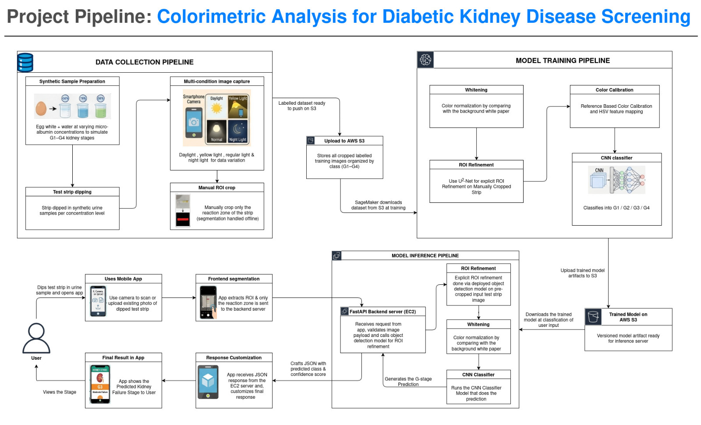
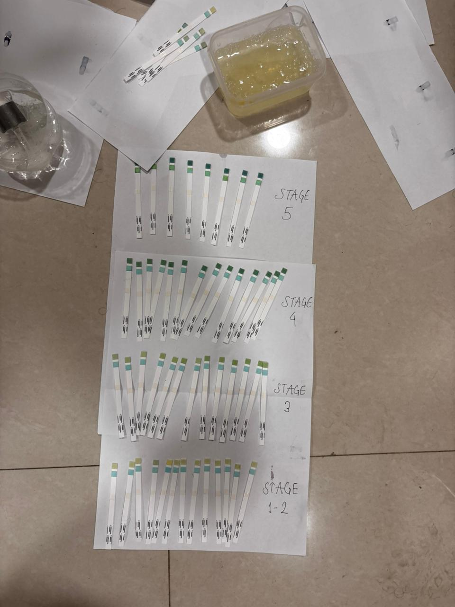
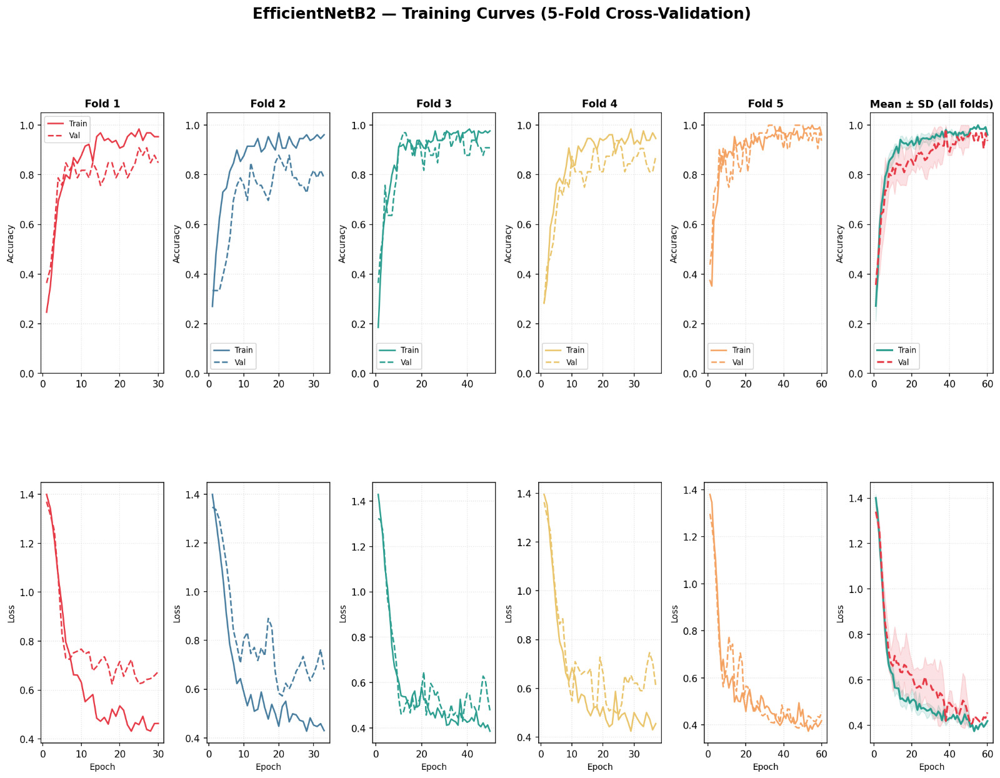
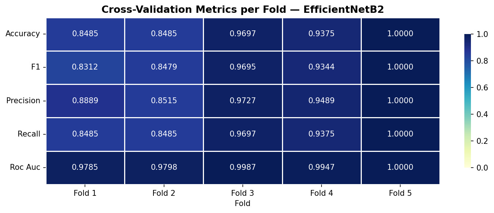

# CalibraKidney 
**An Autonomous AI-Driven Platform for Urinalysis & Kidney Health Screening**

##  Introduction
CalibraKidney is a comprehensive medical diagnostic solution designed to bridge the gap between home-based health monitoring and clinical precision. The traditional interpretation of urinalysis test strips is often subjective, relying on human color matching which can lead to inconsistent results.

CalibraKidney solves this by implementing an end-to-end computer vision pipeline. The system leverages a Deep Convolutional Neural Network (EfficientNet-B2) to automate the interpretation of diagnostic strips, providing real-time, objective stage-wise classification (G1-G4) of kidney filtration health.

---

## ✨ Key Features
* **Precision Scanning**: Custom camera interface designed for standardized image acquisition to minimize environmental noise and lighting variations.
* **High-Fidelity AI Inference**: Offloads image processing to a cloud-based EfficientNet-B2 model, ensuring high-accuracy feature extraction and classification.
* **Longitudinal History**: Integrated archives using `AsyncStorage` to track health trends over time with localized data persistence.
* **Modern Professional UI**: A keyboard-driven, high-performance mobile interface built for the 2026 mobile ecosystem (Android SDK 36).
* **Low Latency**: Optimized edge-to-cloud communication via FastAPI for near-instant results.

---

## 📥 Download & Try It

You can install the latest version of the **CalibraKidney** diagnostic app directly on your Android device to test the AI-driven screening interface.

**[Click here to download the .APK file](https://expo.dev/accounts/rabgaukus/projects/calibrakidney-mobile/builds/aefac875-46aa-43e4-ad7e-dc25b791317e)**

### Scan to Install

Open your phone's camera or a QR scanner to download the application directly to your device:

---

##  System Pipeline & Cloud Architecture
The platform is architected to handle complex medical imaging tasks with a split-infrastructure approach, ensuring fast edge-to-cloud inference.

### Frontend (The Sensor)
* **Framework**: React Native with Expo.
* **Responsibility**: Image acquisition, frontend bounding box/segmentation, state management, and history persistence.
* **Environment**: Configured for Android SDK 36 with hardware-level permissions for camera and storage.

### Intelligence Layer (The Brain)
* **Backend API**: **FastAPI** hosted on an **AWS EC2** instance. It receives the JSON payload and cropped image from the mobile client.
* **Image Processing Pipeline**: 
  1. **ROI Refinement**: Uses explicit object detection algorithms to isolate the exact reaction zone from the pre-cropped input.
  2. **Whitening/Color Calibration**: Normalizes the color space by referencing the background white paper, mitigating lighting anomalies.
  3. **CNN Classifier**: Passes the normalized tensor to the EfficientNet-B2 model for G-stage prediction.

### Infrastructure
* **Storage & Training**: **AWS S3** stores the labeled training images and versioned model artifacts. **AWS SageMaker** handles the heavy model training pipeline.
* **Deployment**: EAS (Expo Application Services) for automated CI/CD and Android build generation.

---

##  Dataset Engineering & Data Collection
To ensure the model generalizes well across real-world environments, the dataset was engineered entirely from scratch through rigorous manual data collection and synthetic sample preparation.

* **Synthetic Sample Preparation**: Created precise micro-albumin concentrations using an egg white and water solution to accurately simulate clinical G1–G4 kidney disease stages.
* **Multi-Condition Capture**: Test strips were manually dipped and photographed under distinct lighting environments (Daylight, Yellow Light, Normal Room Light, and Night Light) using smartphone cameras to inject real-world variance.
* **Manual Annotation**: Reaction zones were manually cropped and labeled before being pushed to AWS S3 for model training.

---

## 🧠 Model Architecture & Benchmarking
The core intelligence engine was selected after rigorous benchmarking. We evaluated **19 different deep learning models** for accuracy, parameter efficiency, and inference speed.

**EfficientNet-B2** was selected as the optimal architecture due to its superior compound scaling, balancing network depth and resolution to detect subtle colorimetric shifts in the reaction pads.

### 5-Fold Cross-Validation Performance
The model was evaluated using a 5-fold cross-validation strategy, demonstrating exceptional reliability and precision across all data subsets. 

* **Metrics**: Reached near-perfect classification in later folds, with an ROC AUC peaking between `0.978` and `1.000`.
* **Consistency**: The training curves show rapid convergence with minimal overfitting, confirming the robustness of the synthetic dataset variance.

---

**Developers:** [Gaurab Kushwaha](https://github.com/GaurabSingh012) | [Lochan Paudel](https://github.com/nahcol10) |  [Anjal Poudel](https://github.com/greninja517)  |
*B.Tech in Artificial Intelligence & Machine Learning | SIT, Pune*
